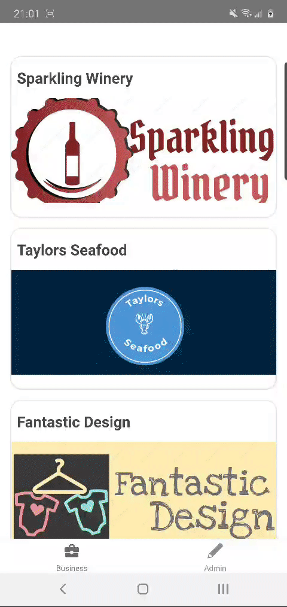

# EssenMate
The aim of this React Native project is to showcase a prototype of our business idea in a hackathon.

## Here are some of the screens that I coded for both iOS and Android.
#### Product item page and map location

### Payment page, which uses a library to interact with stripe (the payment gateway)

### Form and image upload

